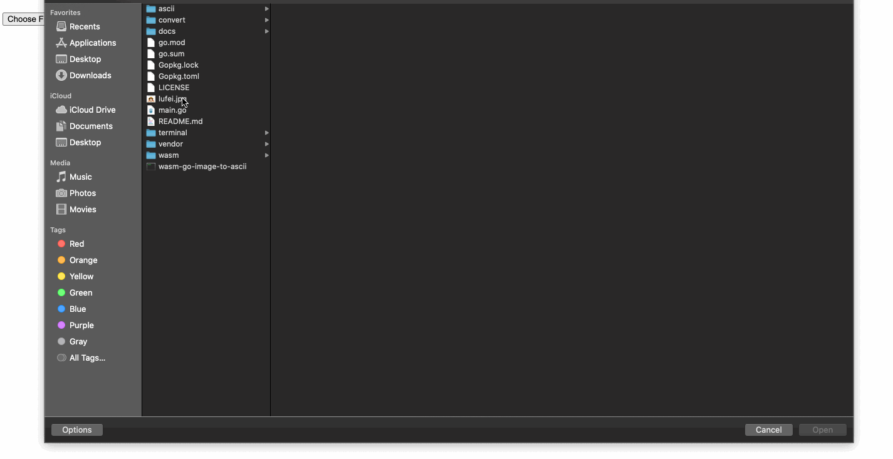

# wasm-go-image-to-ascii

Convert image to ascii on the web using Webassembly ported from golang.
Golang Library: [image2ascii](https://github.com/qeesung/image2ascii)



## Building wasm

```sh
cd ./wasm
```

```
make build
```

Install `goexec`

```
go get -v -u github.com/shurcooL/goexec
```

```
make start-server
```

This will start the server at port `8080`

## Usage

To convert image to ascii the function `convert` is exposed from go to javascript. It takes image `Uint8Array` and configuration to convert to ascii.

```js
array = new Uint8Array(arrayBuffer);

let text = convert(array, {
	fixedWidth: 140
	fixedHeight: 20
	colored: false
	reversed: false
}) // this returns ansi characters

// converting in to html
var ansi_up = new AnsiUp(); // https://github.com/drudru/ansi_up

var html = ansi_up.ansi_to_html(txt);
```

Reading image in javascript: [FileReader API](https://developer.mozilla.org/en-US/docs/Web/API/FileReader)
Image to Ascii configuration: [image2ascii](https://github.com/qeesung/image2ascii)
Ansi to html: [AnsiUp](https://github.com/drudru/ansi_up)

## Example Use case

```js
// Instantiate wasm
const go = new Go();
WebAssembly.instantiateStreaming(fetch("main.wasm"), go.importObject).then(
  (result) => {
    go.run(result.instance);
  }
);
// Listen to file change i.e when user selects a file to upload.
document.querySelector("#file").addEventListener(
  "change",
  function () {
    const reader = new FileReader();
    reader.onload = function () {
      const arrayBuffer = this.result,
        array = new Uint8Array(arrayBuffer);
      // Call wasm exported function
      const txt = convert(
        array,
        JSON.stringify({
          fixedWidth: 100,
          colored: true,
          fixedHeight: 40,
        })
      );
      const ansi_up = new AnsiUp();
      const html = ansi_up.ansi_to_html(txt);
      const cdiv = document.getElementById("console");
      cdiv.innerHTML = html;
    };
    reader.readAsArrayBuffer(this.files[0]);
  },
  false
);
```

## License

This project is under the MIT License. See the [LICENSE](https://github.com/subeshb1/wasm-go-image-to-ascii/blob/master/LICENSE) file for the full license text.
